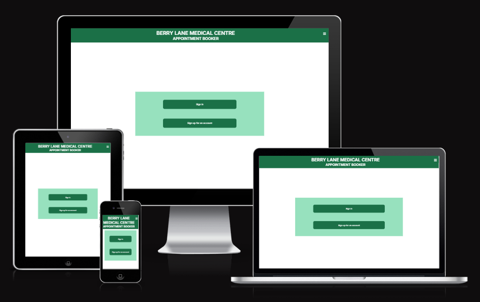
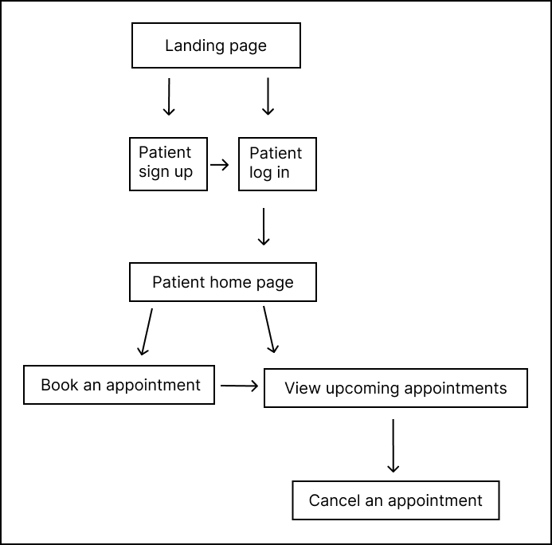
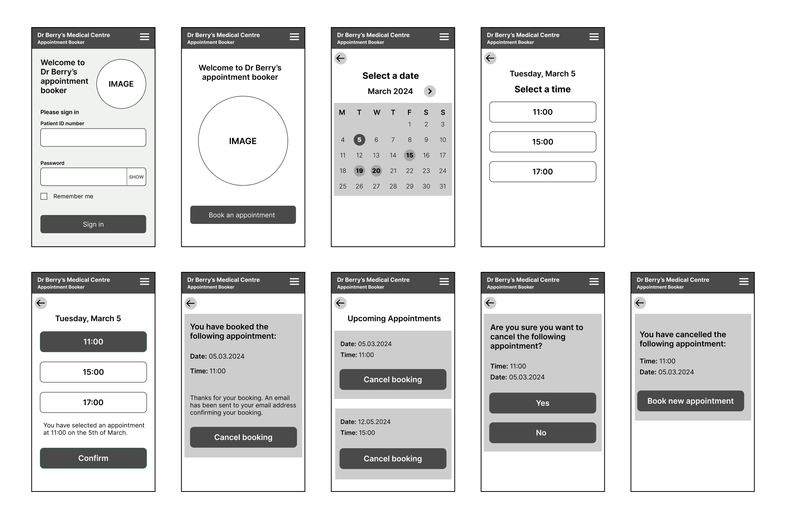
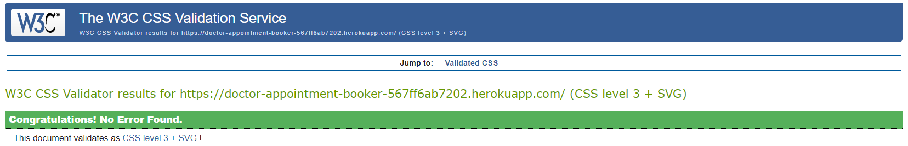

# Medical Appointment Booking Website

This is a website that helps to make it easy for patients to book appointments at
a medical centre. The website helps to reduce the number of calls coming through to
the medical centre. This means that the patients who do call in don't have to
wait as long for their call to be answered.

The doctor adds their availablity in the admin area. The availability is added to 
the list of available appointments in the booking form.

## Table of contents

- [Scope](#scope)
- [User research](#user-research)
- [User stories](#user-stories)
- [Sitemap](#sitemap)
- [Wireframes](#wireframes)
- [Interactive Figma prototype](#interactive-figma-prototype)
- [Build](#build)   
- [Testing](#testing)  
- [Deployment](#deployment)
- [Credits](#credits)

## Scope

The following must be included in the project:

- Patient log in screen
- Sign up form for new account
- Booking form
- List of available appointments
- Ability to view booked appointments
- Ability to cancel appointments

It's not necessary to include the following in the project:

- Doctor log in screen
- Patient notes

## User research

### Who are the users?

- Patients at a medical centre

### User research goals

- Understand user goals when using this type of website
- Understand user pain points when using websites
- Understand what type of tasks users carry out on these types of websites

### User interviews

For the qualitative research, I interviewed people who had experience with booking medical appointments online.

### Surveys

For the quantitative research, I carried out a survey to find out about what users expect from a medical appointment booking website.

### Key insights from the user research

- Site visitors want to be able to set up an account
- Site visitors want to sign in and out of their account easily
- Site visitors want to see a calendar showing available appointments
- Site visitors want to be able to book an appointment easily
- Site visitors don't want to book an appointment that someone else has already booked
- Site visitors want to be able to update or cancel their booking

## User stories

Here is a picture of the GitHub project board for this project:

Epic - patient account

- As a patient I want to set up an account so that I can easily book appointments online
- As a patient I want to be able to sign in and out of my account easily
  
Epic - booking an appointment online

- As a patient I want to book an appointment easily online
- As a patient I want to see a calendar showing available appointments
- As a patient I don't want to book an appointment that someone else has booked

Epic - managing my appointments

- As a patient I want the option to see the appointments that I've booked
- As a patient I want the option of updating my booking
- As a patient I want the option of cancelling my booking

## Sitemap

## Database schema

## Wireframes

These are wireframes for the mobile screens.

## Interactive Figma prototype

I made an interactive prototype in Figma and carried out usability tests with it. Here is a video of the prototype being tested:

https://github.com/user-attachments/assets/7aec1005-023b-4ad7-a664-952665c71e2a

# Build

I built this project with HTML, CSS, JavaScript, Python and Django. 

## Testing

### W3C HTML test

The project passed the W3C HTML test.

### W3C CSS test

The project passed the W3C CSS test.

### JSHint test 

The JavaScript was tested with JSHint and no problems were found.

### CI Python linter test

Python was tested with the CI Python Linter. No major issues were found.

### Browser testing

The website was tested on a variety of browsers. It was also tested in Google 
Chrome DevTools to see what it looks like in a variety of screen sizes.

### Manual testing

As I went through the project I manually tested each user story thoroughly. I tested the views, 
the models, the booking form and the authentication. The user can create an account so that they
can log in. They can log in with their details. They can view the appointments that they've
already booked and they can delete the bookings. 

## Deployment

This project was deployed using Heroku.

A Procfile and a requirements.txt was added to the project.

A new app was set up in Heroku and the config vars were added to the app.

GitHub was selected as the deployment menthod and the GitHub repository was linked to Heroku.

"Deploy Branch" was selected to manually deploy the project.

## Credits

w3 schools 

Codemy.com

Code Institute

Caleb Curry

Tony Teaches Tech

Dennis Ivy

stackoverflow

