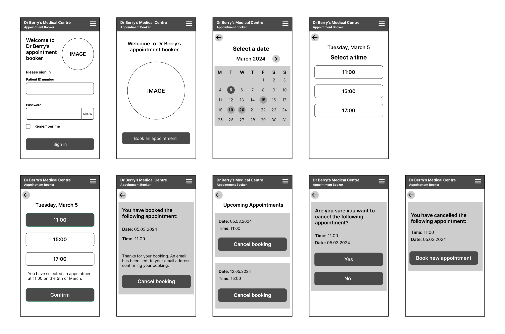

# Medical Appointment Booking App

This is an app that helps to make it easy for patients to book appointments at
a medical centre. The app helps to reduce the number of calls coming through to
the medical centre. This means that the patients who do call in don't have to
wait as long for their call to be answered.

## Scope

The following must be included in the app:

- Patient log in screen
- Sign up form for new account
- Booking form
- List of available appointments
- Ability to view booked appointments
- Ability to cancel appointments

It's not necessary to include the following in the app:

- Doctor log in screen
- Patient notes

## Sitemap

## User Stories

Epic - patient account

- As a patient I want to set up an account so that I can easily book appointments online.
- As a patient I want the option of being able to close my account.
- As a patient I want to be able to change my password.
  
Epic - easy log in

- As a patient I want a way to sign in if I forget my patient ID number or password.
- As a patient I want a way to sign in without having to type in my patient ID number each time.
- As a patient I want a way to remain signed in.

Epic - booking an appointment online

- As a patient I want to book an appointment easily online.
- As a patient I want the option to see the same doctor as last time.

Epic - managing my appointments

- As a patient I want the option to see all the appointments that I've booked.
- As a patient I want the option of cancelling my appointment.
- As a patient I want a confirmation of my booking.

Epic - calendar

- As a patient I want to see available appointments on a calendar.

## Wireframes

These are wireframes for the mobile screens.

## Database Schema

