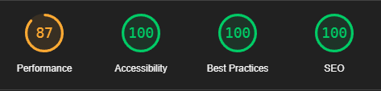

# Medical Appointment Booking Website

This is a website that helps to make it easy for patients to book appointments at
a medical centre. The website helps to reduce the number of calls coming through to
the medical centre. This means that the patients who do call in don't have to
wait as long for their call to be answered.

The doctor adds their availablity in the admin area. The availability is added to 
the list of available appointments in the booking form.

Link to the deployed project:

[Deployed project](https://doctor-appointment-booker-567ff6ab7202.herokuapp.com/)

## Scope

The following must be included in the project:

- Patient log in screen
- Sign up form for new account
- Booking form
- List of available appointments
- Ability to view booked appointments
- Ability to cancel appointments

It's not necessary to include the following in the project:

- Doctor log in screen
- Patient notes

## User research

### Who are the users?

- Patients at a medical centre

### User research goals

- Understand user goals when using this type of website
- Understand user pain points when using websites
- Understand what type of tasks users carry out on these types of websites

### User interviews

For the qualitative research, I interviewed people who had experience with booking medical appointments online.

### Surveys

For the quantitative research, I carried out a survey to find out about what users expect from a medical appointment booking website.

### Key insights from the user research

- Site visitors want to be able to set up an account
- Site visitors want to sign in and out of their account easily
- Site visitors want to see what appointments are available
- Site visitors want to be able to book an appointment easily
- Site visitors don't want to book an appointment that someone else has already booked
- Site visitors want to be able to update or cancel their booking

## User Stories

Here is a picture of the GitHub project board for this project:

Epic - patient account

- As a patient I want to set up an account so that I can easily book appointments online
- As a patient I want to be able to sign in and out of my account easily
  
Epic - booking an appointment online

- As a patient I want to book an appointment easily online
- As a patient I want to see a list of available appointments
- As a patient I don't want to book an appointment that someone else has booked

Epic - managing my appointments

- As a patient I want the option to see the appointments that I've booked
- As a patient I want the option of updating my booking
- As a patient I want the option of cancelling my booking

## Sitemap

## Wireframes

These are wireframes for the mobile screens.

## Database Schema

## Features

### Header

### Menu for users who are not signed in

### Landing page

### Sign up form

### Login form

### User account home page

### Appointment booking form

### Booked appointments page

### Sign out

# Build

I built this project with HTML, CSS, JavaScript, Python and Django. 

## Testing

### W3C HTML Test

The project passed the W3C HTML test.

### W3C CSS Test

The project passed the W3C CSS test.

### JSHint Test 

The JavaScript was tested with JSHint and no problems were found.

### CI Python Linter Test

Python was tested with the CI Python Linter. No major issues were found.

### Browser Testing

The website was tested on a variety of browsers. It was also tested in Google 
Chrome DevTools to see what it looks like in a variety of screen sizes.

### Lighthouse Testing

This is the Lighthouse test result:

### Manual Testing

As I went through the project I manually tested each user story thoroughly. I tested the views, 
the models, the booking form and the authentication. The user can create an account so that they
can log in. They can log in with their details. They can view the appointments that they've
already booked and they can update or delete the bookings. They can use the booking form to book
an appointment and they can choose from a list of available appointments.

## Bugs

There are no current bugs in the project.

These are some of the bugs that occurred during the development of the project:

There was an issue with trying to get the dropdown menu to work. By mistake I hadn't put the link to the JavaScript file in the html file. After I added the link, the dropdown menu worked but was only showing the dropdown part while it was being pressed. Also the words were not visible and the width of the dropdown was very narrow and that's probably why the words weren't on it. I solved the issue by changing the css.

The header was set to position: fixed and was covering the content. To solve this I increased the size of the margin at the top of the main section.

I had problems deploying my project to Heroku. This was solved by adding the correct Config Vars to Heroku.

The navigation menu was showing the same things for signed in users as signed out users. This was solved by changing the urls.

The text on the buttons was not fitting on the buttons in the mobile view so I set the font size in percentage instead of pixels.

I was trying to prevent double bookings by filtering out appointments that had been booked. It wasn't working and the booked appointments were still showing up on the list of available appointments. This was solved by editing the booking view.

## Deployment

This project was deployed using Heroku.

A Procfile and a requirements.txt was added to the project.

A new app was set up in Heroku and the config vars were added to the app.

GitHub was selected as the deployment menthod and the GitHub repository was linked to Heroku.

"Deploy Branch" was selected to manually deploy the project.

## Credits

w3 schools 

Codemy.com

Code Institute

Caleb Curry

Tony Teaches Tech

Dennis Ivy

stackoverflow

## Acknowledgements

The tutors at Code Institute

My mentor DevEd Bowers

